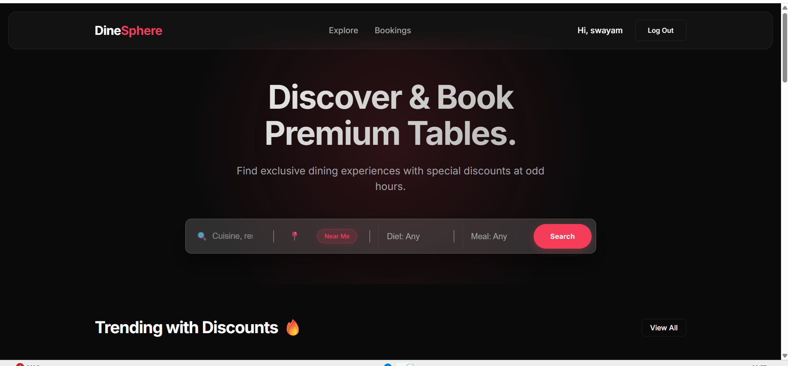
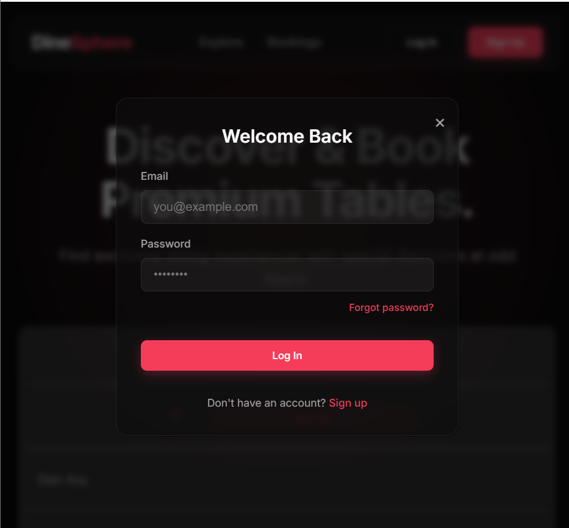
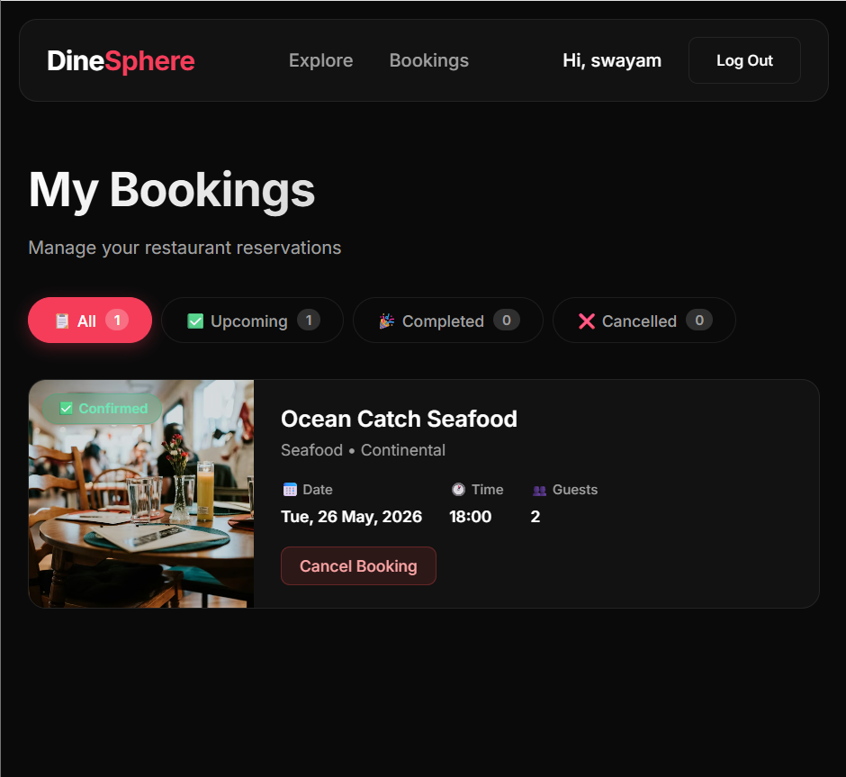
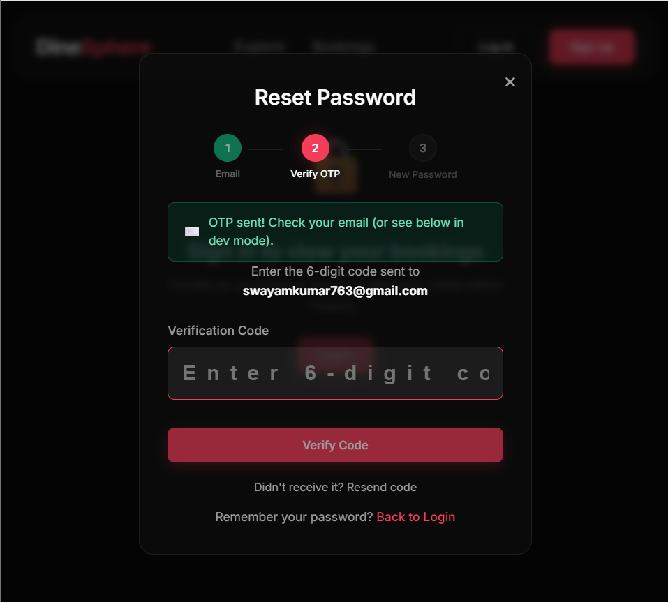

# dinesphere 🍽️ — Premium Restaurant Discovery & Reservation Engine
🌐 Live Demo: https://dinesphere-eight.vercel.app

📦 GitHub Repository: https://github.com/swayamawas/dinesphere
## 📸 Screenshots

### Home Page


### Login / Signup


### Booking Flow


### Forgot Password + OTP


dinesphere is a state-of-the-art, secure, relational-database-backed restaurant discovery and table reservation web application. Designed for the vibrant Indian dining market, dinesphere features a stunning obsidian-crimson glassmorphism UI, real-time location resolution, instant autocomplete suggestions, and a secured bookings controller backed by Prisma ORM and NextAuth.js.

---

## 🌟 Modern Visual Aesthetics

dinesphere is built with a **rich dark-mode aesthetic system**:
*   **Color Palette**: Primary deep obsidian (`#0a0a0a`), balanced by a soft secondary graphite (`#121212`), with glowing accents of deep crimson gradient (`#f53d5a` to `#e12d4a`).
*   **UI Features**: Premium glassmorphism panels, interactive glow states, smooth hover animations, custom animated loaders, and responsive scaling optimized for desktop and mobile viewports.

---

## 🚀 Key Feature Highlights

### ⚡ 1. Debounced Autocomplete Suggestions
*   **Real-time Matching**: As you type inside the keyword input box, a 250ms debounced resolver queries the database (or mock cache) for matching restaurant profiles in real-time.
*   **Matching Dropdown**: Renders a classy **"Matching Restaurants"** pane showcasing the name, cuisine type, and address of the matches.
*   **Direct Routing**: Clicking on any suggested node instantly routes you to the restaurant's dedicated booking page (`/restaurant/[id]`).

### 📍 2. Indian Geolocation Intelligence ("Near Me")
*   **Browser Coordinates**: Integrates an asynchronous Geolocation API handler that queries the user's browser latitude/longitude coordinates.
*   **Indian Hub Mapping**: Computes distance vectors to match coordinate ranges dynamically to the closest premium dining city (Delhi NCR, Mumbai, Bangalore, Pune, Chennai, or Hyderabad).
*   **Instant Query Firing**: Automatically populates the location search bar and triggers search filters with a single click.

### 🕒 3. Interactive Search Pill Tag Board
*   **Dynamic Pill Generation**: Executing search criteria dynamically appends search history tags directly beneath the search console.
*   **One-Click Re-queries**: Clicking any pill tag immediately launches a search query filtering by that keyword.
*   **Cache Management**: Persisted in local browser storage, complete with a dynamic **"Clear All"** option to purge history instantly.

### 🛡️ 4. Secured DB-Backed Booking Engine
*   **Session-Backed Identities**: Secure bookings handled by **NextAuth.js**. Eliminates vulnerable client-side mock parameters by sourcing the user’s ID strictly from cryptographically signed server sessions.
*   **Transaction Pipelines**: Database routes process secure `GET /api/bookings` logs, `POST /api/bookings` reservations, and `PATCH /api/bookings/[id]` cancellations directly.
*   **Dashboard Sync**: Refactored dashboard [bookings/page.tsx](file:///c:/Users/swaya/.gemini/antigravity/scratch/dinesphere/app/bookings/page.tsx) automatically reads, filters (Upcoming, Completed, Cancelled), and canceling reservation states.

### 🔌 5. Resilient Dual-Mode Operation (Fail-Safe Trap)
*   **Zero-Downtime Guarantee**: Wrapped all relational database calls in try-catch fallback traps. If your SQLite migrations are unapplied or your cloud database is offline, **the application gracefully switches to a mock data cache**, keeping the search grid 100% online with zero server crashes!
*   **Dynamic Auto-Seeder**: If tables are generated but empty, the backend **automatically seeds 16+ authentic Indian restaurants on-the-fly** on the first request!

---

## 🛠️ Technology Stack

*   **Frontend Core**: Next.js 14 App Router (React Server & Client Components)
*   **Type Safety**: TypeScript 5
*   **Database ORM**: Prisma Client 5 (Relational mappings with cascading deletes)
*   **Storage Engine**: SQLite (Local development file-store) / PostgreSQL (Production cloud-store)
*   **Authentication**: NextAuth.js (Session cookie guardians, SHA-256 password crypts)
*   **Styling Engine**: Custom HSL Vanilla CSS (Obsidian glassmorphism tokens)

---

## 📁 Core Directory Structure

```text
dinesphere/
├── prisma/                 # Database schema definitions and migration profiles
│   ├── schema.prisma       # Type-safe Prisma models (User, Restaurant, Booking, etc.)
│   └── seed.js             # Seeding file for 16+ premium Indian dining venues
├── app/                    # Next.js App Router Structure
│   ├── api/                # API controllers (auth, bookings, restaurants)
│   ├── bookings/           # User dashboard for tracking and cancelling reservations
│   ├── restaurant/[id]/    # Dynamic reservation profiles with time slots
│   └── page.tsx            # Main home discovery page & search grid
├── components/             # Reusable UI components (Navbar, SearchBox, BookingWidget)
├── data/                   # Fallback mock datasets for fail-safe runtime mode
├── context/                # Client auth context state managers
└── public/                 # Static visual assets
```

---

## ⚙️ Quickstart Installation & Local Setup

### 1. Clone the Codebase
```bash
git clone <your-repository-url>
cd dinesphere
```

### 2. Install Project Dependencies
```bash
npm install
```

### 3. Setup Environmental Settings
Create a `.env` file in the root folder and add the following keys:
```env
# Local SQLite File Database URL
DATABASE_URL="file:./dev.db"

# NextAuth Cryptographic Hash Secrets
NEXTAUTH_SECRET="your_custom_secure_hash_secret_key"
NEXTAUTH_URL="http://localhost:3000"
```

### 4. Build and Seed the Database
Initialize Prisma schema mappings and database tables locally:
```bash
npx prisma db push
npx prisma db seed
```
*(Note: If you run into database setup issues, our **fail-safe trap** will automatically run inside the app, letting the platform load mock backups perfectly!)*

### 5. Launch the Development Server
```bash
npm run dev
```
Open [http://localhost:3000](http://localhost:3000) in your web browser.

---

## 🚀 Cloud Staging & Production Deployment Roadmap

To move dinesphere to public production staging on platforms like **Vercel**, execute the following steps:

### 1. Setup Cloud PostgreSQL (e.g. Supabase, Neon)
Since serverless environments (Vercel) reset local SQLite files, swap the backend provider:
1. Initialize a free PostgreSQL database instance on **Supabase** or **Neon**.
2. Update [schema.prisma](file:///c:/Users/swaya/.gemini/antigravity/scratch/dinesphere/prisma/schema.prisma):
   ```prisma
   datasource db {
     provider = "postgresql"
     url      = env("DATABASE_URL")
   }
   ```

### 2. Secure Production Environment Variables
In your Vercel Project Dashboard under Settings -> Environment Variables, configure:
*   `DATABASE_URL`: Your PostgreSQL connection string.
*   `NEXTAUTH_SECRET`: A secure random hash key.
*   `NEXTAUTH_URL`: Your public domain (e.g. `https://dinesphere.vercel.app`).

### Deployment
DineSphere uses Vercel default Next.js build settings.
Environment variables are configured in the Vercel dashboard.
```

---

*DineSphere Dev Manual – Fully updated.*
